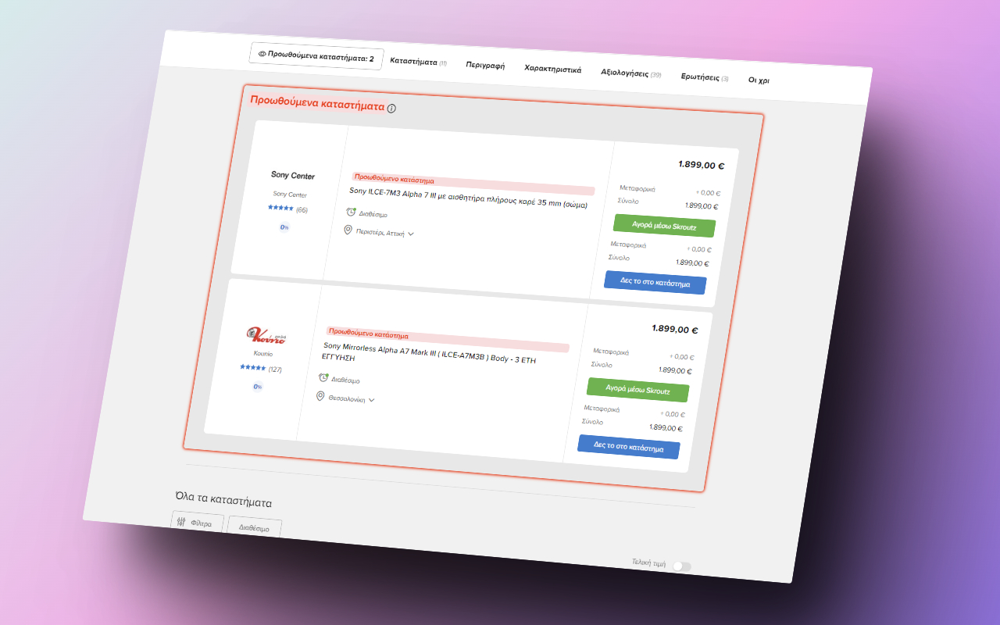
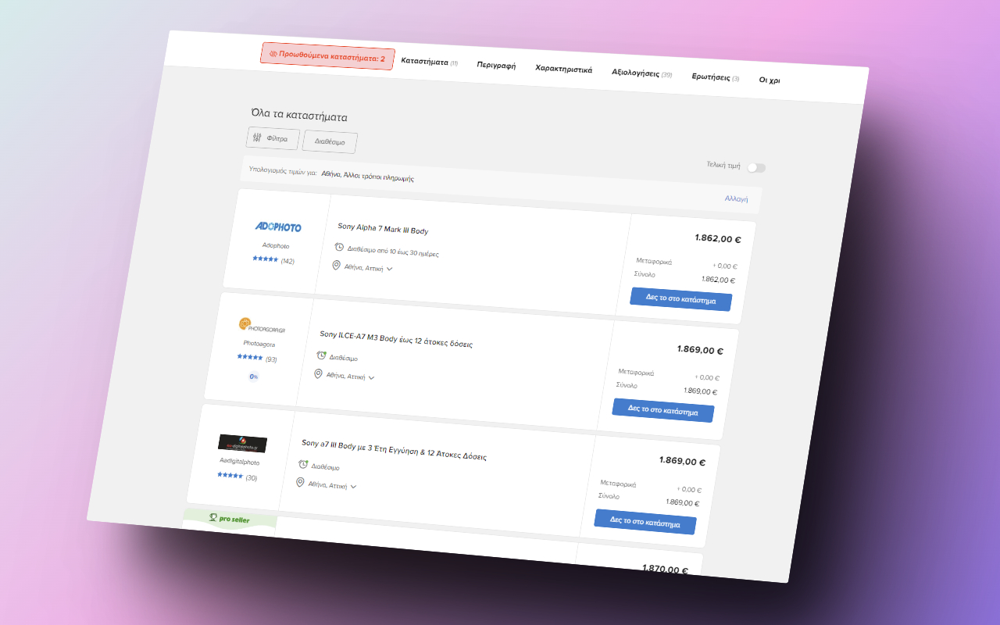

# Skroutz Sponsored Flagger

Skroutz Sponsored Flagger is a browser extension that detects and highlights sponsored products on [skroutz.gr](https://skroutz.gr).
You can start using it by simply downloading it from the [Chrome Extension Store](https://chrome.google.com/webstore/detail/skroutz-sponsored-flagger/amglnkndjeoojnjjeepeheobhneeogcl) or [Firefox Add-ons Store (pending approval)](https://addons.mozilla.org/en-US/firefox/addon/skroutz-sponsored-flagger).

## Why use Skroutz Sponsored Flagger?

Skroutz has been using dark patterns to mislead consumers into purchasing sponsored products (advertisements).
The purpose of this extension is to make it easier for consumers to identify which products are sponsored and which ones are not, so they can make informed purchasing decisions.
It also gives the consumer the ability to hide the sponsored products if they so wish to.

## Manual Installation

To install the extension via Github, simply download the source code from this repository, and follow the instructions based on the browser you wish to load it on.

### Load on Chrome

```bash
npm run build:chrome
```

and load the build extension by clicking `Load unpacked` at `chrome://extensions/` and clicking on the `build/chrome_build` folder.

### Load on Firefox

```bash
npm run build:firefox
```

and load the build extension from `build/firefox_build.zip` file.

### Showcase

|                                                  |                                                   |
| :----------------------------------------------- | :------------------------------------------------ |
|      |      |
|  |  |

## Contributing

Contributions are always welcome! If you have any suggestions or improvements, feel free to submit a pull request.

## License

This extension is licensed under the GNU general public license. See the LICENSE file for more details.
