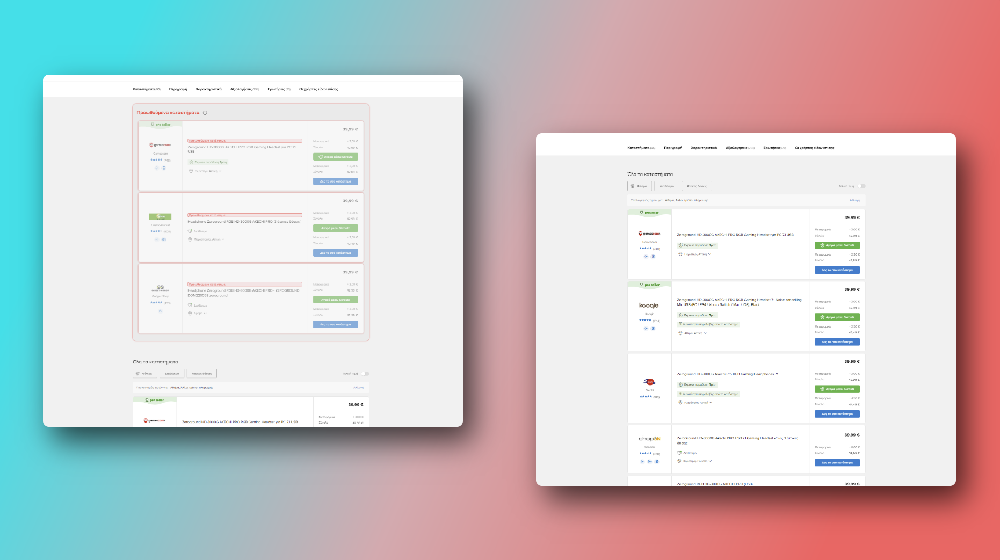

# Skroutz sponsored flagger

## Why

The reason behind this extension, is to make right, a deliberately wrong by Skroutz.
Skroutz has decided to use a dark pattern in order to mislead consumers, in the pursuit of profits.

## How it Works

Once you install the extension, it will automatically detect and highlight all sponsored products in bright red color. This makes it easy for you to identify which products are sponsored and which ones are not. This way, you can make an informed decision about your purchases without being misled by Skroutz's dark pattern.

## Installation

Download it from the Chrome Extension store, by clicking [here](https://chrome.google.com/webstore/detail/skroutz-sponsored-flagger/amglnkndjeoojnjjeepeheobhneeogcl)

To install the extension via github, simply download the source code from this repository and load it as an unpacked extension in any Chromium powered browser..

### Showcase

|                                             |                                             |
| :-----------------------------------------: | :-----------------------------------------: |
|  |  |
|  |  |

## Contributing

Contributions are always welcome! If you have any suggestions or improvements, feel free to submit a pull request.

## License

This extension is licensed under the MIT license. See the LICENSE file for more details.
