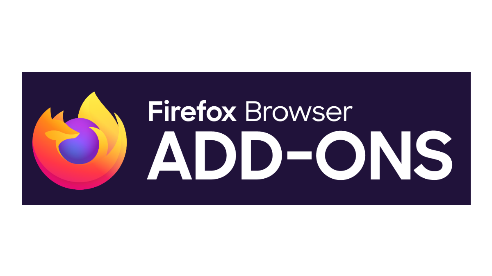

#  ReSkroutzed

### ReSkroutzed is a browser extension that enhances the shopping experience on [skroutz.gr](https://skroutz.gr).<br>


## Why it was made?

> Skroutz has been using dark patterns to mislead consumers into purchasing sponsored products (advertisements). The purpose of this extension is to make it easier for consumers to identify which products are sponsored and which are not, so they can make informed purchasing decisions. It also gives the consumer the ability to hide the sponsored products if they so wish to.

## Additional functionality

- Lowest price checker outside of _"Buy through Skroutz"_
  - Minimum price difference, option to ignore price differences smaller than threshold
- Dark mode
- Sponsored (Ad) product flagging and removal
  - products in category view
  - stores before product price comparison list
  - frequently bought together
  - videos
  - sponsorships
  - banners

## Manual Installation (for contributing)

To install the extension via GitHub, simply download the source code from this repository, and follow the instructions based on the browser you wish to load it on.

### Install Dependencies

```bash
# Install all required dependencies
npm install
```

For development, you can use:

### Development Mode

```bash
# For Chrome development with hot reload
npm run dev:chrome

# For Firefox development with hot reload
npm run dev:firefox
```

These commands will start the extension in development mode with hot reload enabled, making it easier to see your changes in real-time while developing.

### Production Build

#### Build for Chrome

```bash
npm run build:chrome
```

The extension will be built in the `build/chrome_build` folder. To load it in Chrome:

1. Open Chrome and navigate to `chrome://extensions/`
2. Enable "Developer mode" in the top right
3. Click "Load unpacked" and select the `build/chrome_build` folder
4. The extension should now appear in your extensions list

#### Build for Firefox

```bash
npm run build:firefox
```

The extension will be packaged as `build/firefox_build.zip`. To load it in Firefox:

1. Open Firefox and navigate to `about:debugging#/runtime/this-firefox`
2. Click "Load Temporary Add-on"
3. Select the `build/firefox_build.zip` file
4. The extension should now be loaded and active

## Contributing

Contributions are always welcome!

If you have any suggestions for improvements or are facing a bug, feel free to submit a [pull request](https://github.com/keybraker/reskroutzed/discussions).<br>
[Pull requests](https://github.com/keybraker/reskroutzed/pulls) for known problems or ones that solve requests or bugs are very welcome (follow the [Manual Installation](#manual-installation) to start developing!).

## License

This extension is licensed under the GNU general public license. See the LICENSE file for more details.

### Download ReSkroutzed

<div style="display: flex; justify-content: center; gap: 20px;">
  <a href="https://addons.mozilla.org/en-US/firefox/addon/reskroutzed">
    
  </a>
  <a href="https://chrome.google.com/webstore/detail/reskroutzed/amglnkndjeoojnjjeepeheobhneeogcl">
    
  </a>
</div>
